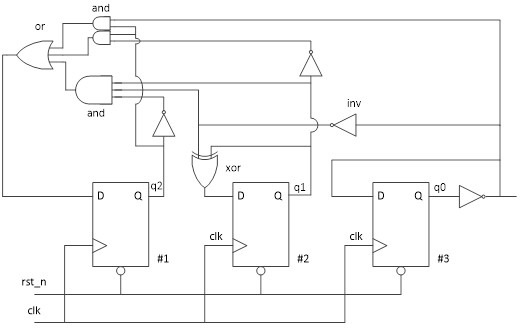

### 数字逻辑设计lab1
本实验分为两个部分，第一部分为基于现有材料的代码修改完善，第二部分为基于电路图的RTL实现。

#### 代码修改部分
+ 计数器和ReLU部分存在功能错误以及语法错误，需要进行修改。Testbench部分仅例化模块部分存在语法错误，只需在例化语句内寻找语法错误。
+ 当所有模块的错误修改结束之后即可进行编译，编译通过之后进行仿真，如果能够得到正确的波形，即说明所有错误均被找出。

#### 实现电路功能
+ 该实验的第二部分是根据以下电路图完成代码的书写，并且完成testbench模块验证功能的正确性
+ 在testbench中注意一开始先复位，才能有激励，否则一直为x态

