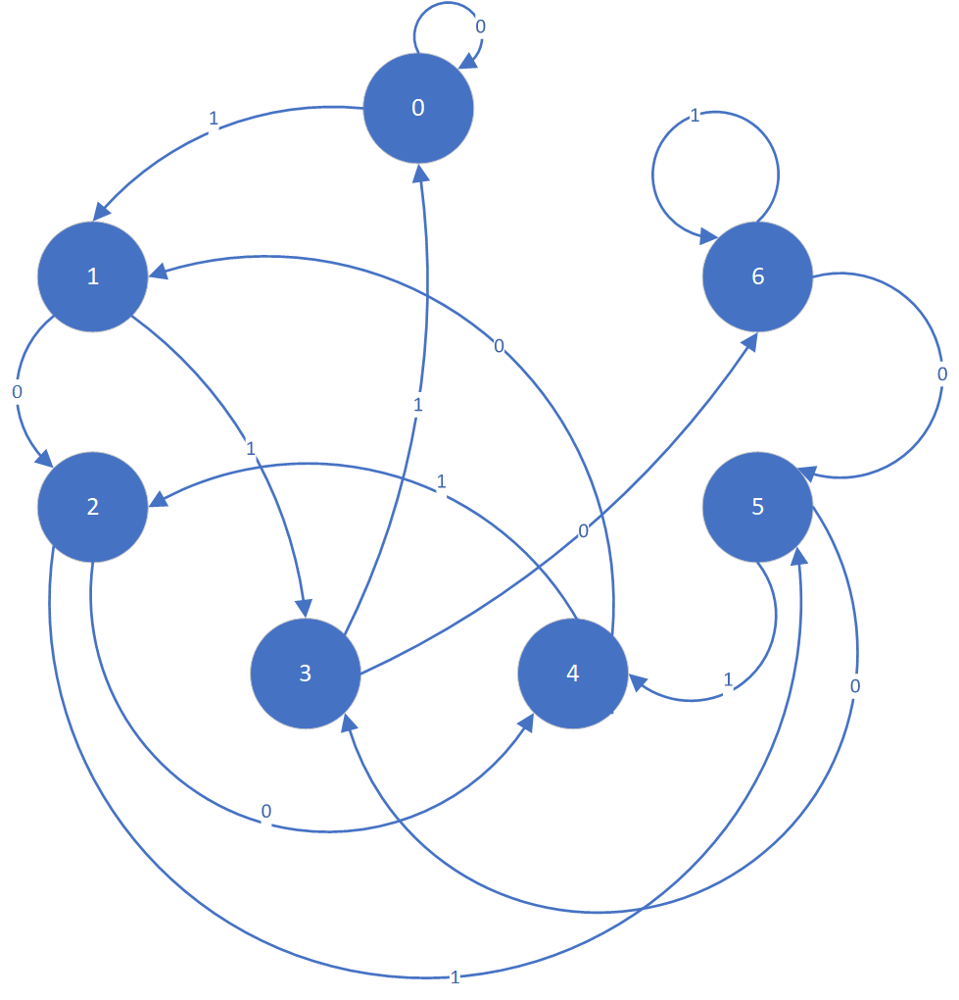
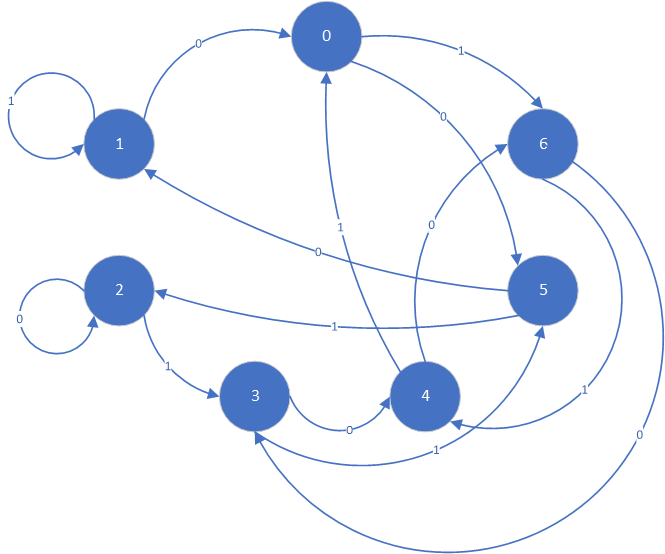

### 数字逻辑设计lab2
+ 本实验分为两个部分，第一部分为序列检测电路代码示例以及新功能的实现，第二部分为移位取余的设计。

#### task1
+ 随机序列中xxx101101xxx检测序列“101101”（左先），每检测到一个序列输出一个周期的脉冲，输入:clk,rstn,data_in，输出:detector， 仅检测不重叠的101101序列。

+ 修改代码，检测可重叠的序列

#### task2
+ 现有16位寄存器。初始值为0。每个时钟周期寄存器的值会左移1位，并且将输入的数据data_in作为寄存器的最低位，寄存器原来的最高位将被丢弃。要求每个周期实时输出该16位寄存器对7求余的余数data_out[2:0]。

+ 不能直接用求余运算符
+ 自行编写testbench，至少检测>2000个数
> 思路：如果寻求直接求一个给出的16位二进制数对7的余数，会比较麻烦，但是已知从0开始，并且每次移进去1或0，这个过程中的变化是确定的，就可以写出对应状态机

 

> 这是最高位不位0时候的状态机，此时每一次进0/1相当于乘2或者乘2+1，符合这个状态机，如果最高位是1，就不是乘2和乘2加1，不符合这个状态机，需要另设计转移方式！这才是最高位是1时候的转换图
 